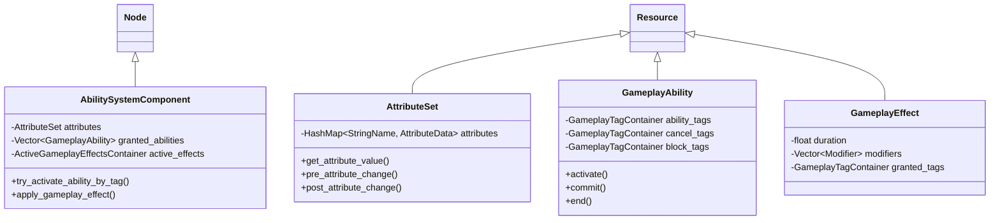

# Zyris Engine: Gameplay Ability System (GAS)

**Technical Design Document v1.0**

| Metadata | Details |
| :--- | :--- |
| **Author** | Assistant (Lead Engine Dev) |
| **Reviewer** | Machi (Technical Director) |
| **Target Version** | Zyris 4.5.0+ |
| **Status** | **RFC (Request for Comments)** |

---

## 1. Executive Summary

The **Zyris Gameplay Ability System (GAS)** is a high-performance, data-driven framework designed to handle the complex interactions of attributes, abilities, and effects in modern games (RPGs, MOBAs, Hero Shooters).

Unlike traditional hard-coded logic, Zyris GAS abstracts gameplay mechanics into three pillars:

1. **Abilities:** Actions a character can perform (Active/Passive).
2. **Attributes:** Numeric values describing the character (Health, Mana, Cooldown Reduc).
3. **Effects:** Data payloads that modify Attributes or Tags (Damage, Buffs, States).

**Key Differentiator:** The implementation of a **Hash Map Inverted Candidate Selection** algorithm, allowing for `O(1)` lookup of applicable abilities/effects based on tags, rather than the industry-standard `O(N)` iteration found in other engines.

---

## 2. Architecture

The system is built as a fundamental part of the Zyris Engine architecture, spanning across the Core and Scene layers. By being a native system, GAS interfaces directly with `Input`, `Node`, and `Resource` with zero overhead and full access to internal engine structures.

### 2.1 Class Hierarchy Overview



---

## 3. The Tag System (GameplayTags)

The backbone of GAS is the **GameplayTag**. Instead of booleans (`is_stunned`, `is_burning`), we use hierarchical tags registered in a central singleton.

### 3.1 Structure

Tags are `StringNames` in the format `A.B.C` (e.g., `State.Debuff.Stun`, `Element.Fire.Weakness`).

### 3.2 Optimization: The Fast Tag Manager

To avoid string comparisons in the hot path, Zyris utilizes a **Fast Tag Manager**:

1. **Registration:** Tags are registered at startup or load time.
2. **Tokenization:** Each tag is assigned a unique `uint32_t` ID.
3. **Bitmasks:** Complex queries utilize bitwise operations where possible for parent/child relationships.

```cpp
// Core struct for efficient passing
struct GameplayTag {
    uint32_t id;
    _FORCE_INLINE_ bool matches(const GameplayTag &p_other) const;
    _FORCE_INLINE_ bool matches_parent(const GameplayTag &p_parent) const;
};
```

---

## 4. Hash Map Inverted Candidate Selection

This is the flagship optimization of the Zyris GAS.

### 4.1 The Problem

In standard implementations (like UE5), checking "What abilities can I activate right now?" often involves iterating through *all* granted abilities (e.g., 50+) and checking their `ActivationTags` against the owner's current tags. This is `O(N * M)`.

### 4.2 The Solution

We maintain an **Inverted Index** within the `AbilitySystemComponent` (ASC).

**Data Structure:**

```cpp
// Map: Tag ID -> List of Ability Indices
HashMap<uint32_t, Vector<Ref<GameplayAbility>>> tag_to_ability_map;
HashMap<uint32_t, Vector<Ref<GameplayAbility>>> tag_to_blocking_ability_map;
```

**Workflow:**

1. **Granting:** When an ability is granted, we scan its `AbilityTags`, `CancelTags`, and `BlockTags`.
2. **Indexing:** We populate the maps. If `Fireball` has tag `Input.Attack`, it goes into `tag_to_ability_map["Input.Attack"]`.
3. **Querying (Hot Path):** When the user presses "Attack" (generating an event with tag `Input.Attack`):
    * **Old Way:** Loop all 50 abilities -> Check if matches `Input.Attack`.
    * **Zyris Way:** `tag_to_ability_map.get("Input.Attack")` -> Returns specifically `[Fireball, SwordSwing]`.

**Complexity:** Reduces selection from `O(N)` to `O(1)` (or `O(K)` where K is the number of matching abilities, usually < 5).

---

## 5. Attributes & The "AttributeSet"

Attributes are `float` values wrapped in a structure that supports modifiers.

### 5.1 Base vs. Current

* **BaseValue:** The permanent value (e.g., Stats from gear + Level).
* **CurrentValue:** The buffered value used for logic (e.g., Base HP - Damage Taken).

### 5.2 AttributeSet Class

Designed to be extended in GDScript or C++.

```cpp
class AttributeSet : public Resource {
    GDCLASS(AttributeSet, Resource);

    // Macro to generate getter/setter/init boilerplate
    #define ATTRIBUTE_ACCESSORS(ClassName, PropertyName) \
        float get_##PropertyName() const; \
        void set_##PropertyName(float p_val); \
        void init_##PropertyName(float p_val);
};
```

---

## 6. Gameplay Effects (GE)

The engine of change. `GameplayEffects` are data-only resources that define *how* attributes change.

### 6.1 Duration Policies

1. **Instant:** Applied immediately (e.g., Damage). Never tracked.
2. **Infinite:** Applied until removed (e.g., Equipment Stats).
3. **Has Duration:** Lasts for `X` seconds (e.g., Poison).

### 6.2 Modifiers

A GE contains a list of modifiers:

* **Operation:** Add, Multiply, Override.
* **Attribute:** Which attribute to target.
* **Magnitude:** Raw number, Scalable Float (Curve), or Attribute-based (e.g., "10% of Target Max HP").

### 6.3 Prediction

For Instant effects, clients predict the change locally. If the server disagrees, a **Reconciliation** packet is sent to rollback the value.

---

## 7. Gameplay Abilities (GA)

The logic containers.

### 7.1 Lifecycle

1. **CanActivate():** Checks Cost (Mana), Cooldown, and Tag Requirements (e.g., cannot cast while `State.Stunned`).
2. **Activate():** Starts the logic (Animation, Projectile).
3. **Commit():** Deducts Cost and starts Cooldown.
4. **End():** Cleans up.

### 7.2 Asynchronous Tasks (AbilityTasks)

Abilities in Zyris rely on `AbilityTasks` to handle state over time without blocking the thread.

* `WaitDelay`
* `WaitInputRelease`
* `WaitGameplayEvent`
* `MoveToLocation`

These are implemented as `RefCounted` objects that emit signals back to the Ability.

---

## 8. Networking & Determinism

Zyris GAS is designed for **Authoritative Server** architecture with **Client-Side Prediction**.

### 8.1 The Prediction Window

1. Client activates Ability -> Plays animation immediately -> Sends RPC to Server.
2. Server receives RPC -> Validates (CanActivate?) -> Executes -> Replicates "Ability Started" to other clients.
3. **Correction:** If Server denies execution (e.g., Cooldown hack detected), it sends a `ClientForceEndAbility` RPC.

### 8.2 Attribute Replication

Attributes utilize a `NetSerializer` with delta compression.

* **High Frequency:** Health, Mana (Replicated on change).
* **Low Frequency:** Strength, Agility (Replicated only on significant events).

### 8.3 Deterministic Execution

To support the "Multiplayer-ready" requirement:

* Effect calculations use fixed-point math (optional via build flag) or strictly ordered float operations.
* Random Number Generation (RNG) is seeded via the `AbilitySystemComponent` to ensure `RandomDamage` is identical on Server and Client if predicted.

---

## 9. Implementation Roadmap

### Phase 1: Core Data Structures (Week 1-2)

* [ ] Implement `GameplayTag` and `GameplayTagManager`.
* [ ] Create `AttributeSet` base class and macros.
* [ ] Implement `AbilitySystemComponent` skeleton.

### Phase 2: Effects & Modifiers (Week 3-4)

* [ ] Implement `GameplayEffect` Resource.
* [ ] Build the Modifier aggregator/calculator in ASC.
* [ ] Add support for "Instant" and "Infinite" durations.

### Phase 3: Abilities & Selection (Week 5-6)

* [ ] Implement `GameplayAbility` class.
* [ ] **CRITICAL:** Implement `Inverted Candidate Selection` (Hash Map logic).
* [ ] Create basic `AbilityTasks`.

### Phase 4: Networking (Week 7-8)

* [ ] Implement `PredictionKey` system for identifying activation windows.
* [ ] Add `MultiplayerSynchronizer` hooks for Attribute sets.

### Phase 5: Tooling (Week 9)

* [ ] Create Debugger Panel (View active tags, attributes, running abilities).
* [ ] Create `GameplayCue` editor for visual feedback.

---

## 10. API Reference (Draft)

### `AbilitySystemComponent`

```cpp
// Registers a new ability and indexes it into the HashMaps
AbilityHandle grant_ability(Ref<GameplayAbility> p_ability_class, int p_level = 1);

// The O(1) Activation Call
bool try_activate_abilities_by_tag(const GameplayTag &p_tag, bool p_allow_remote_activation = true);

// Applies an effect spec to self
ActiveEffectHandle apply_gameplay_effect_to_self(const GameplayEffectSpec &p_spec);
```

### `GameplayAbility`

```cpp
// Virtual function for game logic
virtual void _activate_ability(const GameplayEventData &p_event_data);

// Tag requirements
virtual const GameplayTagContainer* get_activation_required_tags() const;
virtual const GameplayTagContainer* get_activation_blocked_tags() const;
```

---

## 11. Workflow Example

1. **Designer** creates a `GameplayEffect` resource "FireDot.tres":
    * Duration: 5.0s
    * Period: 1.0s
    * Modifier: `Health` Add `-10.0`
    * Stacking: Replace

2. **Designer** creates a `GameplayAbility` resource "Fireball.tres":
    * Cost: `Mana` 20.0
    * Cooldown: 3.0s
    * Logic (GDScript):

        ```gdscript
        func _activate_ability(event_data):
            var projectile = projectile_scene.instantiate()
            get_avatar().add_child(projectile)
            projectile.hit.connect(func(target):
                var effect_spec = make_outgoing_spec(fire_dot_effect)
                target.ability_system.apply_effect(effect_spec)
            )
            end_ability()
        ```

3. **Programmer** adds `AbilitySystemComponent` to `Player.tscn` and grants `Fireball.tres`.

4. **Runtime:** Player presses 'Q'. Input System sends tag `Input.Ability.1`. ASC looks up `Input.Ability.1` in Hash Map -> Finds `Fireball` -> Activates.

---

## 12. Conclusion

The Zyris GAS provides the architectural rigidity required for complex multiplayer games while exposing the flexibility of Godot's Resource system to designers. The **Inverted Candidate Selection** ensures that adding 1000 passive skills to a game does not degrade the performance of checking inputs, maintaining the "High Performance" mandate of the Zyris Engine.
