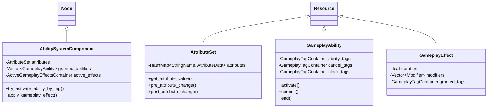

# Zyris Engine: Gameplay Ability System (GAS)

**Documento de Design Técnico v1.0**

| Metadados | Detalhes |
| :--- | :--- |
| **Author** | Assistente (Lead Engine Dev) |
| **Revisor** | Machi (Diretor Técnico) |
| **Versão Alvo** | Zyris 4.5.0+ |
| **Status** | **RFC (Request for Comments)** |

---

## 1. Resumo Executivo

O **Zyris Gameplay Ability System (GAS)** é um framework de alta performance, orientado a dados (*data-driven*), projetado para gerenciar interações complexas de atributos, habilidades e efeitos em jogos modernos (RPGs, MOBAs, Hero Shooters).

Diferente de lógica "hard-coded" tradicional, o Zyris GAS abstrai mecânicas de gameplay em três pilares:

1. **Abilities (Habilidades):** Ações que um personagem pode executar (Ativas/Passivas).
2. **Attributes (Atributos):** Valores numéricos que descrevem o personagem (Vida, Mana, Redução de Cooldown).
3. **Effects (Efeitos):** Cargas de dados que modificam Atributos ou Tags (Dano, Buffs, Estados).

**Diferencial Chave:** A implementação de um algoritmo de **Seleção de Candidatos Invertida por Hash Map** (*Hash Map Inverted Candidate Selection*), permitindo busca `O(1)` de habilidades/efeitos aplicáveis baseados em tags, ao invés da iteração `O(N)` padrão da indústria encontrada em outras engines.

---

## 2. Arquitetura

O sistema é construído como uma parte fundamental da arquitetura da Zyris Engine, abrangendo as camadas Core e Scene. Por set um sistema nativo, o GAS faz interface direta com `Input`, `Node` e `Resource` com zero overhead e acesso total às estruturas internas da engine.

### 2.1 Visão Geral da Hierarquia de Classes



---

## 3. O Sistema de Tags (GameplayTags)

A espinha dorsal do GAS é a **GameplayTag**. Em vez de booleanos soltos (`is_stunned`, `is_burning`), usamos tags hierárquicas registradas em um singleton central.

### 3.1 Estrutura

Tags são `StringNames` no formato `A.B.C` (ex: `State.Debuff.Stun`, `Element.Fire.Weakness`).

### 3.2 Otimização: Fast Tag Manager

Para evitar comparações de strings no *hot path*, a Zyris utilize um **Fast Tag Manager**:

1. **Registro:** Tags são registradas na inicialização ou carregamento.
2. **Tokenização:** Cada tag recebe um ID `uint32_t` único.
3. **Bitmasks:** Consultas complexas utilizam operações bit a bit onde possível para relações pai/filho.

```cpp
// Struct core para passagem eficiente
struct GameplayTag {
    uint32_t id;
    _FORCE_INLINE_ bool matches(const GameplayTag &p_other) const;
    _FORCE_INLINE_ bool matches_parent(const GameplayTag &p_parent) const;
};
```

---

## 4. Seleção de Candidatos Invertida por Hash Map

Esta é a otimização principal do Zyris GAS.

### 4.1 O Problema

Em implementações padrão (como UE5), verificar "Quais habilidades posso ativar agora?" frequentemente envolve iterar por *todas* as habilidades concedidas (ex: 50+) e checar suas `ActivationTags` contra as tags atuais do dono. Isso é `O(N * M)`.

### 4.2 A Solução

Mantemos um **Índice Invertido** dentro do `AbilitySystemComponent` (ASC).

**Estrutura de Dados:**

```cpp
// Mapa: ID da Tag -> Lista de Índices de Habilidades
HashMap<uint32_t, Vector<Ref<GameplayAbility>>> tag_to_ability_map;
HashMap<uint32_t, Vector<Ref<GameplayAbility>>> tag_to_blocking_ability_map;
```

**Fluxo de Trabalho:**

1. **Concessão (Granting):** Quando uma habilidade é concedida, escaneamos suas `AbilityTags`, `CancelTags` e `BlockTags`.
2. **Indexação:** Populamos os mapas. Se `BolaDeFogo` tem a tag `Input.Attack`, ela vai para `tag_to_ability_map["Input.Attack"]`.
3. **Consulta (Hot Path):** Quando o usuário pressiona "Atacar" (gerando um evento com tag `Input.Attack`):
    * **Método Antigo:** Loop em 50 habilidades -> Checar se combina com `Input.Attack`.
    * **Método Zyris:** `tag_to_ability_map.get("Input.Attack")` -> Retorna especificamente `[BolaDeFogo, GolpeDeEspada]`.

**Complexidade:** Reduz a seleção de `O(N)` para `O(1)` (ou `O(K)` onde K é o número de habilidades correspondentes, geralmente < 5).

---

## 5. Atributos & "AttributeSet"

Atributos são valores `float` encapsulados em uma estrutura que suporta modificadores.

### 5.1 Base vs. Actual

* **BaseValue:** O valor permanente (ex: Stats de equipamento + Nível).
* **CurrentValue:** O valor "bufferizado" usado para lógica (ex: HP Base - Dano Recebido).

### 5.2 Classe AttributeSet

Projetada para set estendida em GDScript ou C++.

```cpp
class AttributeSet : public Resource {
    GDCLASS(AttributeSet, Resource);

    // Macro para gerar boilerplate de getter/setter/init
    #define ATTRIBUTE_ACCESSORS(ClassName, PropertyName) \
        float get_##PropertyName() const; \
        void set_##PropertyName(float p_val); \
        void init_##PropertyName(float p_val);
};
```

---

## 6. Efeitos de Gameplay (Gameplay Effects - GE)

O motor de mudança. `GameplayEffects` são recursos puramente de dados que definem *como* os atributos mudam.

### 6.1 Políticas de Duração

1. **Instantâneo:** Aplicado imediatamente (ex: Dano). Nunca rastreado.
2. **Infinito:** Aplicado até set removido (ex: Stats de Equipamento).
3. **Com Duração:** Dura por `X` segundos (ex: Veneno).

### 6.2 Modificadores

Um GE contém uma lista de modificadores:

* **Operação:** Adicionar, Multiplicar, Sobrescrever.
* **Atributo:** Qual atributo atingir.
* **Magnitude:** Número bruto, Float Escalável (Curva), ou Baseado em Atributo (ex: "10% do HP Máx do Alvo").

### 6.3 Predição

Para efeitos Instantâneos, clientes predizem a mudança localmente. Se o servidor discordar, um pacote de **Reconciliação** é enviado para reverter (rollback) o valor.

---

## 7. Habilidades de Gameplay (Gameplay Abilities - GA)

Os containers de lógica.

### 7.1 Ciclo de Vida

1. **CanActivate():** Checa Custo (Mana), Cooldown e Requisitos de Tag (ex: não pode conjurar enquanto `State.Stunned`).
2. **Activate():** Inicia a lógica (Animação, Projétil).
3. **Commit():** Deduz Custo e inicia Cooldown.
4. **End():** Limpeza.

### 7.2 Tarefas Assíncronas (AbilityTasks)

Habilidades na Zyris dependem de `AbilityTasks` para lidar com estado ao longo do tempo sem bloquear a thread.

* `WaitDelay`
* `WaitInputRelease`
* `WaitGameplayEvent`
* `MoveToLocation`

Estas são implementadas como objetos `RefCounted` que emitem sinais de volta para a Habilidade.

---

## 8. Rede & Determinismo

Zyris GAS é projetado para arquitetura de **Servidor Autoritativo** com **Predição do Cliente**.

### 8.1 Janela de Predição

1. Cliente ativa Habilidade -> Toca animação imediatamente -> Envia RPC ao Servidor.
2. Servidor recebe RPC -> Valida (CanActivate?) -> Executa -> Replica "Habilidade Iniciada" para outros clientes.
3. **Correção:** Se o Servidor negar execução (ex: hack de Cooldown detectado), envia um RPC `ClientForceEndAbility`.

### 8.2 Replicação de Atributos

Atributos utilizam um `NetSerializer` com compressão delta.

* **Alta Frequência:** Vida, Mana (Replicado na mudança).
* **Baixa Frequência:** Força, Agilidade (Replicado apenas em eventos significativos).

### 8.3 Execução Determinística

Para suportar o requisito "Multiplayer-ready":

* Cálculos de efeitos usam matemática de ponto fixo (opcional via flag de build) ou operações float estritamente ordenadas.
* Geração de Números Aleatórios (RNG) é "semeada" via `AbilitySystemComponent` para garantir que `RandomDamage` seja idêntico no Servidor e Cliente se predito.

---

## 9. Roadmap de Implementação

### Fase 1: Estruturas de Dados Core (Semana 1-2)

* [ ] Implementar `GameplayTag` e `GameplayTagManager`.
* [ ] Criar classe base `AttributeSet` e macros.
* [ ] Implementar esqueleto do `AbilitySystemComponent`.

### Fase 2: Efeitos & Modificadores (Semana 3-4)

* [ ] Implementar Resource `GameplayEffect`.
* [ ] Construir o agregador/calculador de Modificadores no ASC.
* [ ] Adicionar suporte para durações "Instant" e "Infinite".

### Fase 3: Habilidades & Seleção (Semana 5-6)

* [ ] Implementar classe `GameplayAbility`.
* [ ] **CRÍTICO:** Implementar `Seleção de Candidatos Invertida` (Lógica Hash Map).
* [ ] Criar `AbilityTasks` básicas.

### Fase 4: Rede (Semana 7-8)

* [ ] Implementar sistema de `PredictionKey` para janelas de ativação.
* [ ] Adicionar hooks do `MultiplayerSynchronizer` para Attribute sets.

### Fase 5: Ferramentas (Semana 9)

* [ ] Criar Painel de Debug (Ver tags ativas, atributos, habilidades rodando).
* [ ] Criar editor de `GameplayCue` para feedback visual.

---

## 10. Referência de API (Rascunho)

### `AbilitySystemComponent`

```cpp
// Registra uma nova habilidade e a indexa nos HashMaps
AbilityHandle grant_ability(Ref<GameplayAbility> p_ability_class, int p_level = 1);

// A Chamada de Ativação O(1)
bool try_activate_abilities_by_tag(const GameplayTag &p_tag, bool p_allow_remote_activation = true);

// Aplica uma especificação de efeito em si mesmo
ActiveEffectHandle apply_gameplay_effect_to_self(const GameplayEffectSpec &p_spec);
```

### `GameplayAbility`

```cpp
// Função virtual para lógica do jogo
virtual void _activate_ability(const GameplayEventData &p_event_data);

// Requisitos de Tag
virtual const GameplayTagContainer* get_activation_required_tags() const;
virtual const GameplayTagContainer* get_activation_blocked_tags() const;
```

---

## 11. Exemplo de Fluxo

1. **Designer** cria um resource `GameplayEffect` "FireDot.tres" no **Zyris Studio**:
    * Duração: 5.0s
    * Período: 1.0s
    * Modificador: `Health` Adicionar `-10.0`
    * Empilhamento: Substituir

2. **Designer** cria um resource `GameplayAbility` "Fireball.tres" no **Zyris Studio**:
    * Custo: `Mana` 20.0
    * Cooldown: 3.0s
    * Lógica (GDScript):

        ```gdscript
        func _activate_ability(event_data):
            var projectile = projectile_scene.instantiate()
            get_avatar().add_child(projectile)
            projectile.hit.connect(func(target):
                var effect_spec = make_outgoing_spec(fire_dot_effect)
                target.ability_system.apply_effect(effect_spec)
            )
            end_ability()
        ```

3. **Programador** adiciona `AbilitySystemComponent` ao `Player.tscn` e concede `Fireball.tres`.

4. **Runtime:** Jogador pressiona 'Q'. Sistema de Input envia tag `Input.Ability.1`. ASC busca `Input.Ability.1` no Hash Map -> Encontra `Fireball` -> Ativa.

---

## 12. Conclusão

O Zyris GAS provê a rigidez arquitetural necessária para jogos multiplayer complexos enquanto expõe a flexibilidade do sistema de Resources do Godot aos designers. A **Seleção de Candidatos Invertida** garante que adicionar 1000 habilidades passivas ao jogo não degrade a performance de checagem de inputs, mantendo o mandato de "Alta Performance" da Zyris Engine. Através do **Zyris Studio**, a complexidade desses dados é gerenciada de forma visual e eficiente.
