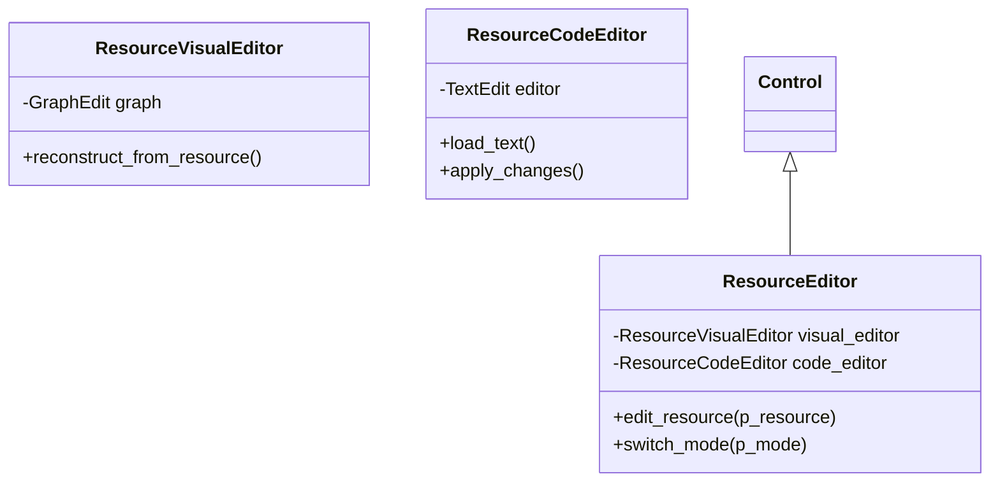

# Resource Editor (Main Panel System)

**Documento de Design Técnico v1.0**

| Metadados | Detalhes |
| :--- | :--- |
| **Author** | Assistente (Lead Engine Dev) |
| **Revisor** | Machi (Diretor Técnico) |
| **Status** | **RFC (Request for Comments)** |

---

## 1. Resumo Executivo

O **Resource Editor** é um sistema central da Zyris Engine, integrado diretamente ao **Main Panel** (ao lado de 2D, 3D e Script). Ele substitui o fluxo limitado de edição exclusiva pelo Inspetor, permitindo que qualquer `.tres` ou resource customizado seja aberto em uma área de trabalho dedicada com suporte a edição dual: **Visual** e **Code**.

Ao selecionar um Resource no FileSystem, a Zyris Engine o abre simultaneamente no Inspetor (para ajustes rápidos) e no Main Panel (para arquitetura e edição profunda).

**Objetivos Chave:**

1. **Edição Dual:** Alternância fluida entre um editor de grafos (Visual) e um editor de texto (Code).
2. **Cidadão de Primeira Classe:** Posicionamento no Main Panel, reconhecendo que dados são tão críticos quanto scripts e cenas.
3. **Arquitetura de Dados:** Foco na composição de components e gerenciamento de estados de resources complexos.

---

## 2. Interface e Modos de Trabalho

O Resource Editor ocupa o espaço central do editor e oferece dois modos de visualização:

### 2.1 Modo Visual (Graph Mode)

Uma bancada de trabalho baseada em grafos para montar a hierarquia do Resource.

* **Composição:** Arrastar components para dentro do resource raiz.
* **Conexões:** Ligar propriedades e eventos entre diferentes sub-resources.
* **Organização:** Gerenciamento visual de metadados de layout.

### 2.2 Modo Code (Text Mode)

Um editor de texto integrado, similar ao editor de Scripts, mas focado no formato serializado do Resource.

* **Edição Direta:** Modificar valores brutos rapidamente.
* **Refatoração:** Copiar, colar e substituir blocos de dados serializados.
* **Debug:** Visualizar exatamente como o Resource está sendo salvo no disco.

---

## 3. Arquitetura Técnica

O sistema reside em `editor/resource_editor` e faz interface direta com o `EditorNode`.

### 3.1 Components de Sistema

---

## 4. The Library (A Biblioteca)

Integrada como a aba lateral do Resource Editor, a **Library** funciona como um navegador de "Blueprints" e Templates.

* **Templates:** Atalhos para criar Resources pré-configurados (Ex: Personagem Básico, Item de Loot).
* **Drag & Drop:** Integrado para arrastar novos components diretamente para o Modo Visual.

---

## 5. Fluxo de Trabalho Integrado

1. O usuário clica em `PlayerAttributes.tres`.
2. A engine detecta que é um Resource e ativa a aba **Resource** no Main Panel.
3. O **Inspetor** mostra as propriedades básicas.
4. O **Resource Editor** (Main Panel) mostra a estrutura de grafos (Modo Visual).
5. O usuário alterna para **Modo Code** para renomear uma variável em massa ou verificar um ID.
6. As alterações são sincronizadas em tempo real entre Inspetor, Modo Visual e Modo Code.

---

## 6. Conclusão

O **Resource Editor** remove a barreira entre o design de dados e a implementação técnica. Ao oferecer modos Visual e Code no painel principal, a Zyris Engine permite que desenvolvedores e designers trabalhem no mesmo asset usando a ferramenta mais eficiente para cada tarefa, mantendo a integridade e a clareza da arquitetura de dados do projeto.
